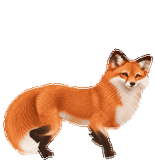

# Maple

A gentle red fox with a storybook look, curious gaze, blink, greeting, trot and hop.

**Current version: 2.1.0 prototype.** This includes the larger trot and smoother connected-leg artwork.

[Download the ZIP](https://github.com/zoozorocks01/Avatars/raw/refs/heads/main/maple/v2.1/Maple-v2.1.0-Prototype.zip) · [Human install guide](../INSTALL.md) · [Agent guide](../AGENT-INSTALL.md) · [Release notes](v2.1/RELEASE-NOTES.md) · [Manifest](v2.1/manifest.json)

The installation ID stays `maple-v2-1`, even when future release versions change. Prototype limitations are documented, not hidden: some bent hind-leg angularity, overlapping dark paws, slight head-scale differences and hop/gaze stiffness remain.

Maple is original AI-assisted fox artwork, with deterministic animation refinement. The host app controls action triggers and cursor/typing attention. No custom behavior engine or automatic updater is included.
