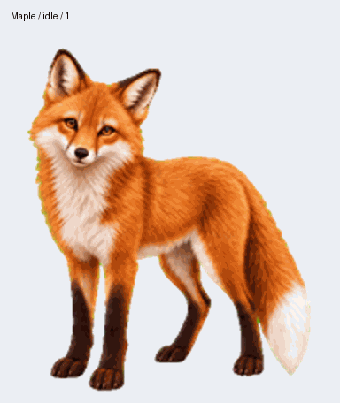

# Maple — Work v2 compatibility preview

This preview preserves the current locally refined Maple artwork, including the longer trot legs, softer bends, and aligned ground contact. It removes the legacy extra neutral cell to match the Work v2 layout. All 73 required poses remain pixel-identical to the local source.

This is a development preview, not a new installable desktop release or a verified ChatGPT cloud update. The existing v2.1 download and catalog entry remain the desktop release.

## Files and checks

- [Sprite sheet](spritesheet.webp), [all-state GIF](all-states.gif), [MP4](all-states.mp4), and [contact sheet](contact.png).
- [Stills](stills.png), [idle/jump transition](idle-jump-idle.gif), [gaze sheet](directions.png), and [gaze loop](look-loop.gif).
- [Structural validation](validation.json), [geometry checks](geometry.json), and [checksums](manifest.json).

The encoded sheet passes the local Work v2 structural validator: 1536×2288, 73 occupied required cells, 15 transparent unused cells. Jump geometry measures 15 pixels of lift and a one-pixel landing difference from idle.

**Not ready for promotion:** gaze silhouettes vary in width by 1.526×, exceeding the current 1.50× geometry limit. The review action also needs clearer inspection intent, and some neighboring gaze angles are too similar. These failures have not been waived. The full quality gate, timed host playback, and cloud upload verification remain incomplete.

Next: refine the coherent gaze row and review animation after Cosmo. No scripted behavior or automatic updater is included.
